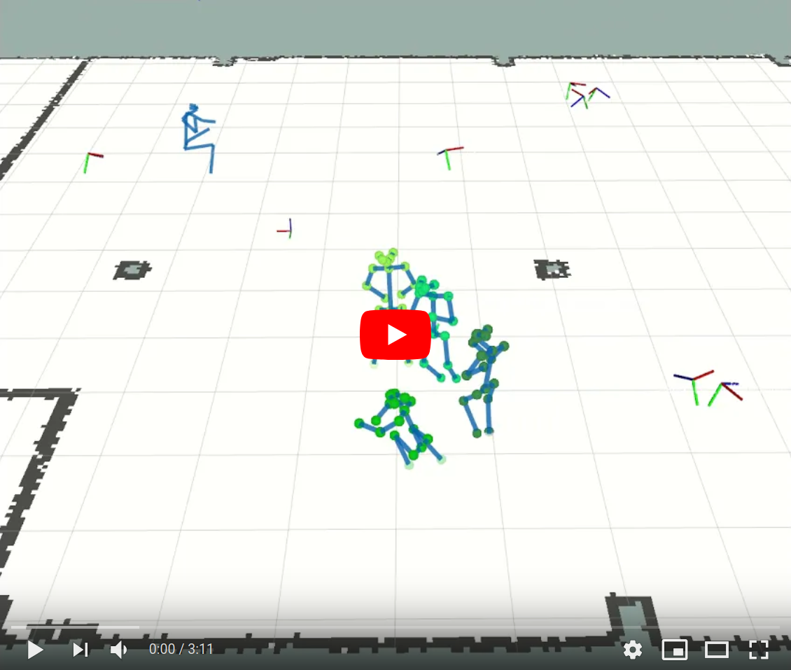

# Multi Hypothesis Tracking

ROS package providing generic libraries for Multi Hypothesis Tracking.

# Details

[General Functionality](documentation/general_functionality.md)

[Usage](documentation/usage.md)

# License

This package is licensed under BSD-3.