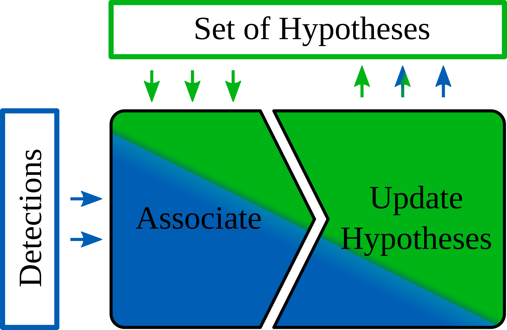
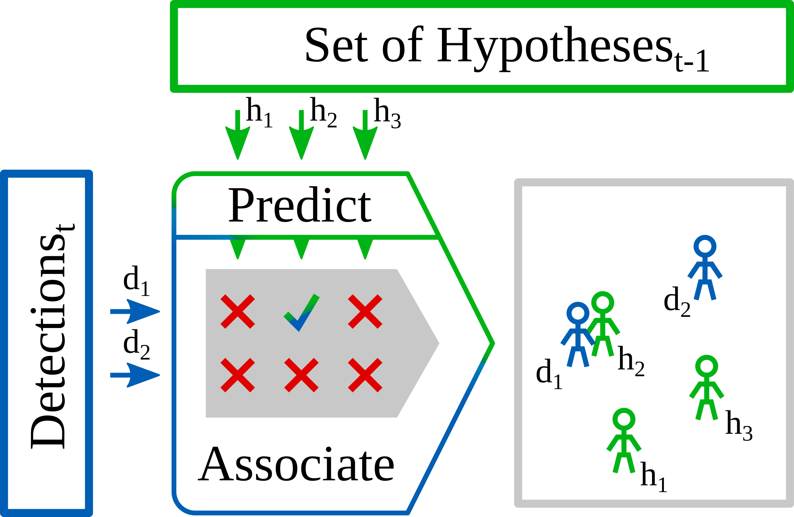
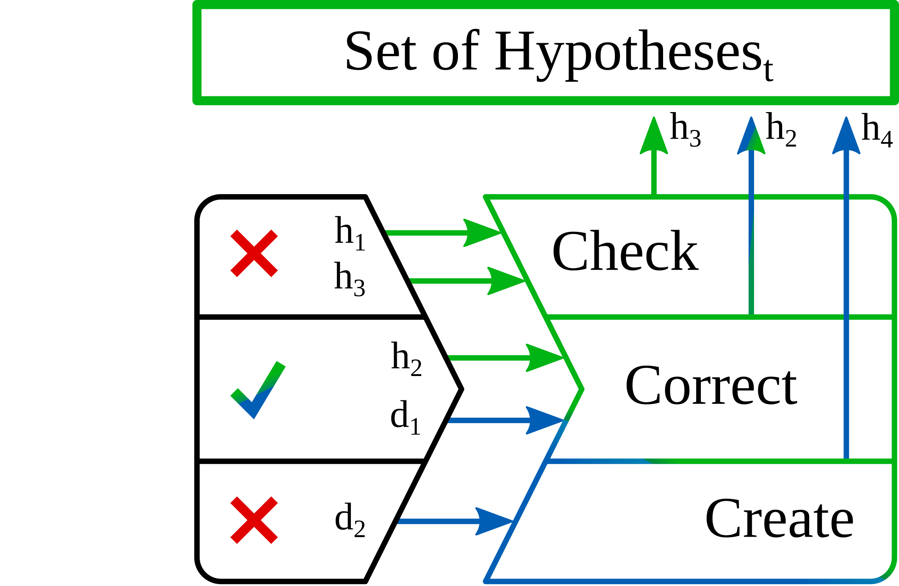

# Multi Hypothesis Tracking in General

In the following, we will explain the general functionality of our Multi Hypothesis Tracker.  
The exemplary use case consists of a robot trying to move in an environment shared with humans.  
The humans need to be tracked in order to avoid collisions while planing our moves.  
The tracker can be applied to all kinds of entities besides humans.  

## Overview

The purpose of the Multi Hypothesis Tracker is to monitor how a set of humans moved.  
For that, we maintain a **set of hypotheses** - one hypothesis per human.  
Each hypothesis represents our belief of where a human is and what pose it has.  

The tracker relies on a detection algorithm providing detections of where the humans currently are.  
Every time we get a new **set of detections** - for example human pose estimations - we **associate** those to the hypotheses.  
Meaning, we try to find a detection and a hypothesis that correspond to the same human in the real world.  
After finding the correspondences, we **update** the hypotheses based on the data from the detections. 

## Association Step

Let's assume we have three hypotheses and two detections (grey box in the image).  
The hypotheses are visualized in green, the detections in blue.  
So, we have our old beliefs of where the humans were and our detections of where they are roughly now. 

We assume that hypotheses and detections corresponding to the same humans in the real world have low distances.  

In order to ease up the association process, we try to predict where our hypotheses are at the time the detections were generated.  
For this we use a constant velocity model.  
We use the movement vector from the previous to the current position.  
We apply it to the current position to get the predicted position. 

For human pose estimates, we apply the constant velocity model to each joint individually. 

Next, we compute the distances between each hypothesis and every detection.  
We apply the Hungarian Method to compute the associations based on these distances. 

For human pose estimates, we use the distances between the mid hip joints.  
The mid hip joint lays between the right and the left hip - roughly the lower end of the spine.  

In our example only detection 1 and hypothesis 2 correspond to the same human. 

## Update Step

After finding the associations, we update our beliefs of where the humans are by updating the hypotheses.  
There are three cases we need to address.

### Case 1 - Check

The first case represents a hypothesis we couldn't find a detection for.  
This can happen if a person leaves the sensor's field of view or the detection algorithm fails for whatever reason.  
Here we need to decide whether we want to keep the hypothesis, in case the human reappears or whether we delete the hypothesis for good.  

### Case 2 - Correct

The second case consists of a hypothesis that was matched successfully to a detection.  
Here, we correct our belief of the human's pose with the new information from the detection.  
For that, we use a separate Kalman Filter for each joint of the human.  
We update each joint position with the corresponding joint position of the detection.  

### Case 3 - Create 

The third case occurs when a detection cannot be associated to an existing hypothesis.  
This can happen if a human walks into the sensor's field of view or when we have a false positive detection of a non-existing human.  
Here, we have to decide whether we want to create a new hypothesis or discard the detection.  

After updating the set of hypotheses, one iteration is finished and the tracker waits for a new set of detections.
